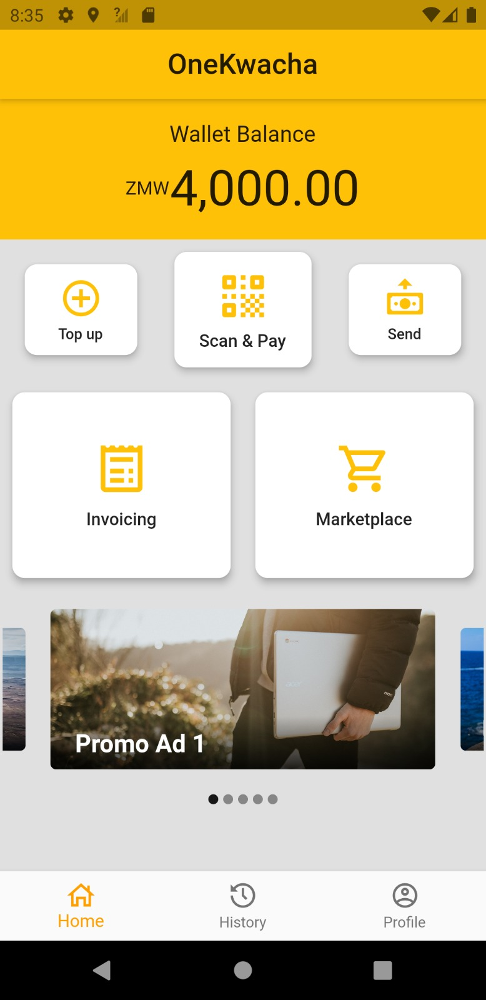
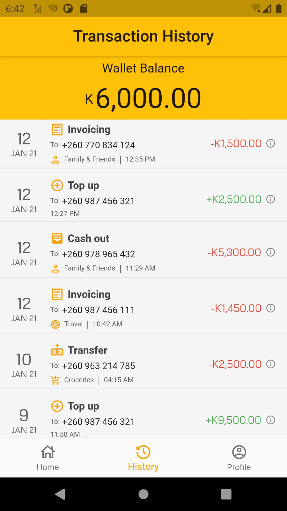
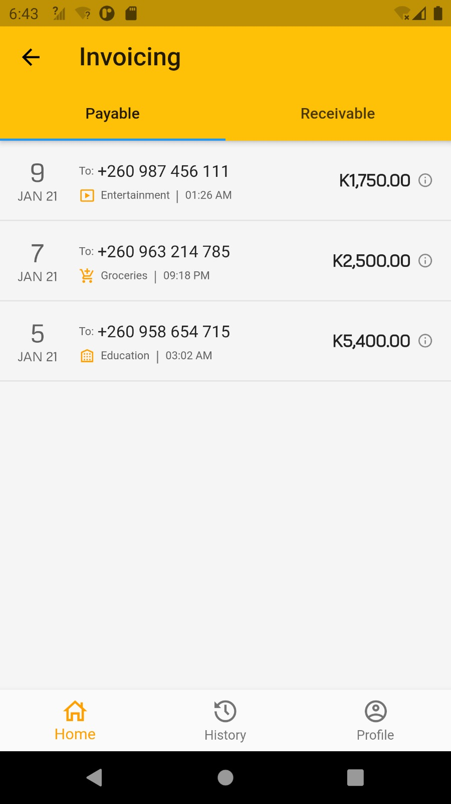
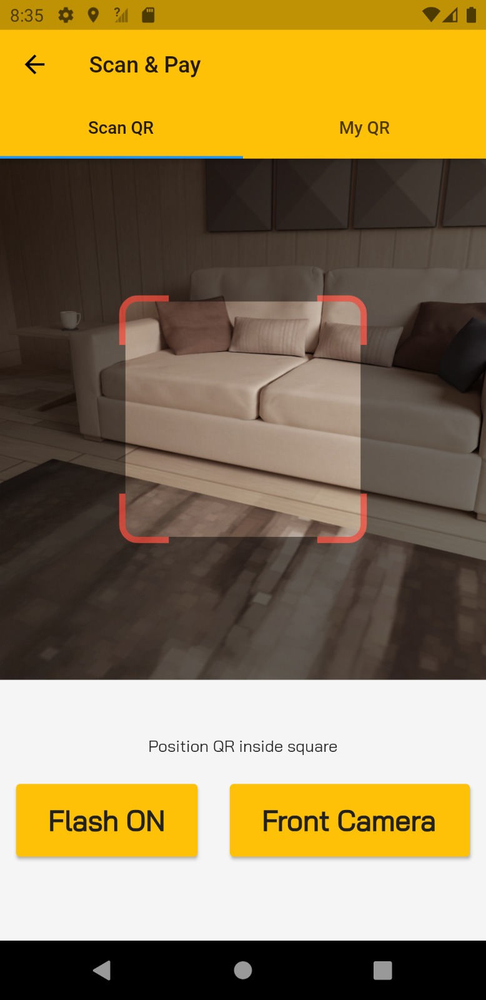
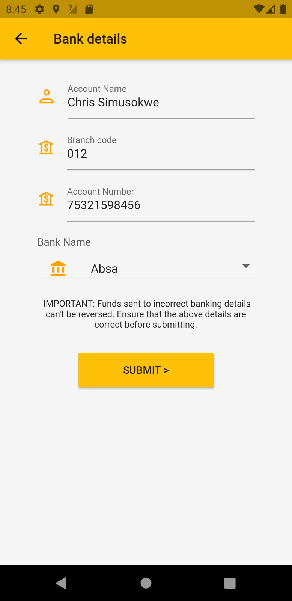

# OneKwacha

## Overview
OneKwacha is a comprehensive mobile payments application built with Flutter, designed to provide secure and convenient digital financial services. The app enables users to manage their digital wallet, transfer money, make payments, and conduct various financial transactions seamlessly.

## Key Features

### 💰 Digital Wallet Management
- **Real-time Balance Tracking**: Monitor your wallet balance with live updates
- **Transaction History**: View detailed transaction records with filtering and grouping
- **Multi-currency Support**: Built-in support for Zambian Kwacha (ZMK) with proper formatting

### 📱 Payment & Transfer Options
- **Peer-to-Peer Transfers**: Send money to other OneKwacha users instantly
- **Mobile Money Integration**: Top-up and transfer to/from mobile money services
- **Bank Account Transfers**: Direct transfers to major Zambian banks (Absa, Access, Ecobank, FNB, Stanchart, Zanaco)
- **Card Payments**: Support for major card networks (Visa, MasterCard, American Express, Discover, JCB, Verve)

### 🔄 QR Code Payments
- **Scan & Pay**: Quick payments by scanning QR codes
- **Generate QR**: Create personalized QR codes for receiving payments
- **Offline Payments**: Enable transactions without internet connectivity

### 📄 Invoice Management
- **Create Invoices**: Generate payment requests with detailed information
- **Invoice Tracking**: Monitor invoice status (Active, Paid, Declined)
- **Payment Processing**: Pay invoices directly through the app
- **Receivables & Payables**: Separate tabs for money owed and money to be received

### 🛒 Marketplace Integration
- **Third-party Services**: Purchase products from integrated merchants
- **Utility Payments**: Pay for services like electricity (Zesco), TV (DSTV, GoTV)
- **Mobile Airtime**: Top-up mobile credit for various networks
- **Real-time Processing**: Instant transaction processing with merchant APIs

### 🔐 Security & Authentication
- **Firebase Authentication**: Secure phone number-based login with OTP verification
- **Transaction Verification**: Multi-step confirmation process for all transactions
- **Error Handling**: Comprehensive error management and user feedback

## Technical Stack

### Frontend
- **Framework**: Flutter/Dart
- **State Management**: Stateful widgets with real-time data updates
- **UI/UX**: Material Design with custom theming and responsive layouts

### Backend & Services
- **Database**: Cloud Firestore for real-time data synchronization
- **Authentication**: Firebase Auth with phone number verification
- **Storage**: Firebase Storage for user documents and images
- **Analytics**: Firebase Analytics for user behavior tracking

### Key Dependencies
- `firebase_core` & `firebase_auth` - Authentication and core Firebase services
- `cloud_firestore` - Real-time database operations
- `qr_flutter` & `qr_code_scanner` - QR code generation and scanning
- `intl` & `currency_text_input_formatter` - Internationalization and currency formatting
- `image_picker` - Profile picture and document uploads
- `http` - API communications with external services

## App Architecture

### Core Models
- **User Model**: Profile management and balance tracking
- **Transaction Model**: Recording and retrieving transaction data
- **Invoice Model**: Managing payment requests and settlements
- **Marketplace Model**: External service integrations

### Screen Structure
- **Authentication Flow**: Login/Register with OTP verification
- **Home Dashboard**: Balance overview and quick actions
- **Transfer Screen**: Money transfer with multiple destination options
- **Top-up Screen**: Wallet funding from external sources
- **Scan & Pay**: QR code-based payment system
- **Invoice Management**: Create, view, and manage invoices
- **Marketplace**: Browse and purchase from integrated services
- **Transaction History**: Detailed transaction records with search/filter
- **Profile Management**: User settings and account information

## Transaction Types & Fees
- **Top-up**: 1.5% fee for adding money to wallet
- **Transfers**: 1% fee for peer-to-peer transactions
- **Invoicing**: 2.5% fee for payment requests
- **Marketplace**: No additional fees (merchant-specific pricing)
- **Cash-out**: 5% fee for wallet-to-bank transfers

## Supported Platforms
- iOS (iPhone/iPad)
- Android (smartphones/tablets)

## Screenshots

*Main dashboard with balance overview and quick actions*

*Detailed transaction history with categorization*

*Invoice creation and management interface*

*QR code payment processing*

*Bank transfer configuration screen*

## Getting Started

### Prerequisites
- Flutter SDK (>=2.12.0 <4.0.0)
- Firebase project configuration
- Android Studio / Xcode for device testing

### Installation
1. Clone the repository
2. Run `flutter pub get` to install dependencies
3. Configure Firebase for your project
4. Add your `google-services.json` (Android) and `GoogleService-Info.plist` (iOS)
5. Run `flutter run` to start the application

## License
This project is a mobile payments application designed for the Zambian market, focusing on financial inclusion and digital payment accessibility.

